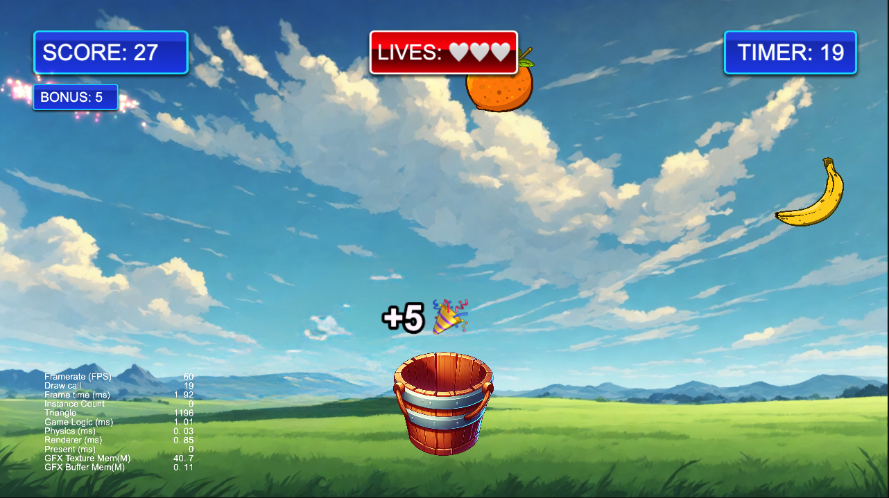

# 🍓 Happy Fruits — Test Game Project

> 🎮 A simple and juicy game prototype made in **Cocos Creator 3.8** using **ECS architecture**.

---

## 🚀 Game Description

"Happy Fruits" is a fun arcade game where the player controls a **basket** to catch falling fruits. Catch fruits to earn points, avoid dangerous ones, and try to score as high as you can before time runs out!

---

## 🎯 Features

- 🧺 **Mouse-controlled basket**
- 🍎 **Random fruits falling from the top**
- ⏱️ **Game timer**
- 💯 **Score tracking**
- 🍄 **Dangerous fruits (e.g., mushrooms)**
- 🔥 **Bonus combo system**: catch 3+ fruits in a row to earn extra points!
- 💥 **Particle effects on fruit catch**
- ✨ **Animated floating score labels**
- 📱 **Screen-adaptive spawn positions**
- 🧩 **ECS (Entity Component System) architecture**
---

## ⚙️ Architecture Overview

The project is built on a custom **ECS architecture**:

### 🔧 Components
- `View` — stores the node reference
- `Velocity` — movement speed
- `Fruit` — type and danger status
- `Collider` — bounding box info
- `ZigzagMotion` — side-to-side movement logic
- `Combo` — current combo streak
- `ScoreLabel` — label that shows floating score

### ⚙️ Systems
- `FruitSpawnSystem` — spawns fruit with optional zigzag
- `MovementSystem` — moves entities using velocity
- `CollisionSystem` — detects and resolves collisions
- `ComboSystem` — handles bonus combo logic
- `DestroyOffscreenSystem` — cleans up entities that fall below screen
- `ParticleSystem` — spawns effects like explosion or label fire
- `ScoreSystem` — increases score and creates floating labels
- `GameTimerSystem` — handles game duration
---

## 🧪 Technical Details

- **Engine**: Cocos Creator 3.8+
- **Language**: TypeScript
- **Architecture**: Custom ECS (Entity Component System)
- **Resolution**: HD (1280x720)
- **Controls**: Mouse (or touch)

---

## 📂 How to Run

1. Open the project in **Cocos Creator 3.8 or later**
2. Open the `Main.scene`
3. Press ▶️ **Run Preview**
---
